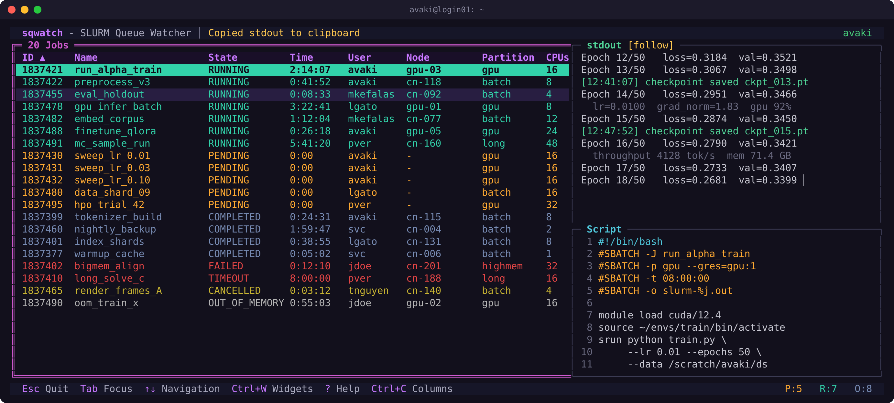

# sqwatch - SLURM Queue Watcher

[](https://crates.io/crates/sqwatch)
[](https://github.com/fedonman/sqwatch/actions/workflows/ci.yml)
[](https://github.com/fedonman/sqwatch#requirements)
[](LICENSE)
[](https://ratatui.rs/)

A lightweight terminal UI for watching and managing SLURM job queues in real time.

`sqwatch` gives you a live, interactive dashboard for your SLURM cluster right in the terminal. You can browse jobs, read their scripts and logs, filter by any field, and cancel jobs without leaving the command line.

<p align="center">
  
</p>

<p align="center"><sub>Live dashboard with a sample queue: color-coded job table, a following stdout tail, and the submission script pane.</sub></p>

## Features

- **Live queue view.** An auto-refreshing job table with color-coded states (pending, running, failed, completed, suspended, out of memory, and so on). Your selection and cursor position survive each refresh, and jobs are fetched on a background thread so the UI never stalls.
- **Filtering.** A persistent sidebar filters by user (regex), job name (regex), state, partition, QoS, or node. Partitions, QoS values, and nodes are read from the cluster automatically. Filter settings are saved to disk and restored the next time you launch.
- **Column configuration.** Choose which `squeue` fields to show, reorder them, and set multi-level sort priorities. Column settings are saved too.
- **Script inspector.** View the submission script for any job, with syntax highlighting through [`bat`](https://github.com/sharkdp/bat) when it is installed, or plain text with line numbers when it isn't. Scripts load on a background thread.
- **Log viewer.** Tail stdout and stderr logs in real time. Changes to the files are picked up automatically with the `notify` crate.
- **Custom output widgets.** Add your own file-watching panels for any job output files. JSON is pretty-printed for you.
- **Widget layout.** Toggle individual panels on and off (filters, script, stdout, stderr, custom widgets) and save the layout you prefer.
- **Clipboard support.** Copy a widget's contents to the system clipboard with OSC 52, which works over SSH and inside tmux without X11 or Wayland.
- **Bulk actions.** Select one job or many and cancel them together after a confirmation prompt. Any errors from `scancel` show up in the flash notification bar.

## Requirements

- **SLURM client utilities.** `squeue`, `scontrol`, `sinfo`, `scancel`, and `sacctmgr` must be on your `PATH`.
- **Rust 1.90 or newer**, needed only if you build from source.
- **Optional:** [`bat`](https://github.com/sharkdp/bat) for syntax-highlighted script viewing.

## Installation

From [crates.io](https://crates.io/crates/sqwatch):

```sh
cargo install sqwatch
```

From source:

```sh
git clone https://github.com/fedonman/sqwatch.git
cd sqwatch
cargo install --path .
```

## Usage

```sh
sqwatch
```

The UI starts immediately. It detects your username from `$USER` and displays all jobs by default (with `--all --states=all` passed to `squeue`).

### Configuration

Settings are stored in `~/.config/sqwatch/` (or `$XDG_CONFIG_HOME/sqwatch/`):

| File | Contents |
|------|----------|
| `filters.json` | Saved filter presets (user, states, partitions, QoS, nodes, name pattern) |
| `columns.json` | Visible columns and sort order |
| `layout.json` | Widget visibility and custom widget definitions |

Press `Ctrl+S` inside the filter sidebar, column dialog, or widget selector to persist the current configuration.

## Keybindings

### Global

| Key | Action |
|-----|--------|
| `Tab` | Cycle focus to next visible widget |
| `Shift+Tab` | Cycle focus to previous visible widget |
| `w` | Open widget selector (toggle panel visibility) |
| `c` | Open column / sort configuration (when table is focused) |
| `Esc` | Return focus to table, or quit if already on table |
| `Ctrl+C` | Copy focused widget contents to clipboard, or quit if on table |

### Job Table

| Key | Action |
|-----|--------|
| `Up` / `Down` | Navigate job list |
| `Space` | Toggle selection on focused job |
| `a` | Select / deselect all |
| `x` | Cancel selected jobs (with confirmation) |

### Script / Log / Custom Widgets

| Key | Action |
|-----|--------|
| `Up` / `Down` | Scroll content |
| `PageUp` / `PageDown` | Scroll one page |
| `Ctrl+U` / `Ctrl+D` | Scroll one page (vim-style) |
| `Shift+Up` / `Shift+Down` | Switch to previous/next job in the table |

### Filter Sidebar

| Key | Action |
|-----|--------|
| `Up` / `Down` | Navigate between fields and filter sections |
| `Enter` | Edit text field or toggle checkbox |
| `Space` | Toggle checkbox item |
| `Ctrl+S` | Save filter settings to disk |

### Column / Sort Configuration

| Key | Action |
|-----|--------|
| `Up` / `Down` | Navigate within a list |
| `Left` / `Right` | Switch between pool, active, and sort lists |
| `Enter` | Add field to selected / sort, or toggle sort order |
| `Del` | Remove field from list |
| `Shift+Up` / `Shift+Down` | Reorder items |
| `Tab` | Cycle between lists |
| `r` | Reset to defaults |
| `Ctrl+S` | Save column settings to disk |
| `Esc` | Close |

### Widget Selector

| Key | Action |
|-----|--------|
| `Up` / `Down` | Navigate widget list |
| `Enter` / `Space` | Toggle widget visibility |
| `Ctrl+S` | Save layout to disk |
| `Esc` | Close |

## Architecture

The project is organized into four modules:

```
src/
├── main.rs                # Entry point: terminal setup and teardown
├── dashboard.rs           # Central orchestrator: event loop, state, rendering
├── backend/
│   ├── mod.rs             # Job and JobState data types
│   ├── commands.rs        # Async wrappers around SLURM CLI tools
│   └── query.rs           # squeue invocation and output parsing
├── core/
│   ├── mod.rs
│   ├── input.rs           # Keyboard/mouse/timer event loop (crossbeam channels)
│   ├── config.rs          # Filter, column, and layout persistence (JSON, XDG paths)
│   ├── job_fetcher.rs     # Background thread for periodic squeue refreshes
│   ├── job_detail.rs      # Background scontrol cache (LRU, max 64 entries)
│   └── live_file.rs       # File watcher for live log tailing (notify crate)
└── views/
    ├── mod.rs
    ├── chrome.rs           # Titlebar, statusbar, and layout framing
    ├── job_table.rs        # Job list table with selection and sorting
    ├── filter_tree.rs      # Persistent filter sidebar with regex text fields and checkbox lists
    ├── fields.rs           # Column and sort configuration dialog
    ├── script_widget.rs    # Job script viewer with optional bat highlighting
    ├── output_widget.rs    # Live log viewer (stdout/stderr)
    ├── custom_widget.rs    # User-defined file-watching panels
    ├── widget_selector.rs  # Panel visibility toggle popup
    └── theme.rs            # Centralized color constants
```

**Dashboard** is the central hub. It owns all view components, the query parameters, the tokio runtime for async SLURM commands, and the input event channel. The main loop is: receive input signal → dispatch to the appropriate handler → redraw.

**Backend** wraps all SLURM interactions. Commands are executed asynchronously via `async-process` and dispatched through a shared tokio runtime. The query module builds `squeue` invocations with dynamic format strings and parses the pipe-delimited output.

**Core** handles cross-cutting concerns: the input loop runs on a dedicated thread, multiplexing keyboard, mouse, resize, and timer events into a single `crossbeam` channel. Background workers (`job_fetcher` and `job_detail`) run SLURM queries off the main thread, communicating results back via crossbeam channels polled on timer ticks. The config module manages JSON persistence for filters, columns, and layout. The live file watcher uses `notify` to detect log file changes for real-time tailing.

**Views** are pure rendering components. Each one receives a `Frame` and `Rect` from ratatui and draws itself. The filter sidebar is a persistent side panel, while overlays (column config, widget selector) are rendered on top of the main layout via popup regions.

## Developers

### Prerequisites

- Rust 1.90+ (the minimum supported Rust version)
- A working SLURM environment for manual testing (or mock the CLI tools)

### Building

```sh
cargo build
```

### Running checks

```sh
cargo fmt --all --check                     # Formatting (requires nightly rustfmt)
cargo clippy --all-targets -- -D warnings   # Linting
cargo test                                  # Tests
cargo deny check                            # License and advisory audit
```

### Project conventions

- **Edition 2024.** Uses let-chains and other recent Rust features.
- **No `unsafe`.** The codebase is entirely safe Rust.
- **Async for SLURM commands only.** The TUI event loop is synchronous. Async is used only to keep the SLURM CLI calls from blocking, through `async-process` and tokio. Background workers talk to the dashboard over crossbeam channels rather than async.
- **`color-eyre`** for error handling. A `Result<()>` flows from `main()` down through the dashboard.

## Contributing

1. Fork the repository and create a feature branch from `main`.
2. Make your changes. Every PR must include an entry in `CHANGELOG.md` following the [Keep a Changelog](https://keepachangelog.com/) format.
3. Ensure all CI checks pass: formatting, clippy, tests, MSRV build, and `cargo-deny`.
4. Open a pull request against `main`. All merges use squash merge.

### Changelog format

Each PR gets a single bullet point under the appropriate section (`Added`, `Changed`, `Fixed`, `Removed`). End the entry with a link to the PR:

```markdown
- Description of the change. [PR #N](https://github.com/fedonman/sqwatch/pull/N)
```

## License

Apache-2.0
